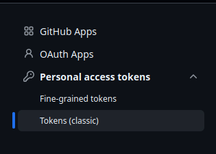
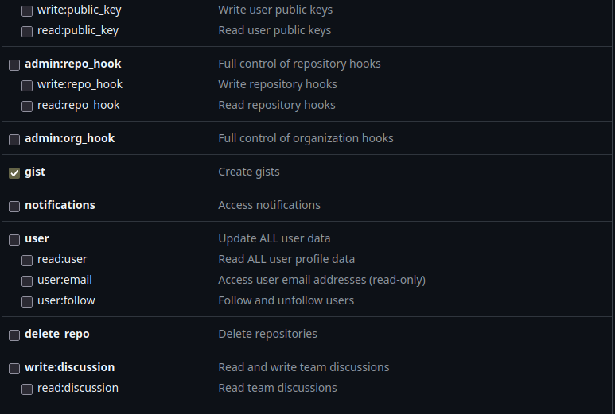

# Gist Playground

[Gist Playground](https://gist-playground.netlify.app) is a lightweight, web-based IDE designed to browse, edit, share and preview GitHub Gists directly in your browser. Powered by [Alpine.js](https://alpinejs.dev/) and [Ace Editor](https://ace.c9.io/), it provides a smooth, professional coding environment without the bloat of a full desktop IDE.

## Features

-   **GitHub Integration:** Browse Gists from any GitHub user.
    
-   **Code Sandbox:** Edit your files using the full-featured Ace Editor, complete with syntax highlighting and auto-completion.
    
-   **Live Preview:** Instant HTML/CSS/JS preview in an isolated iframe.
    
-   **Deep Linking:** Share your work instantly with custom URLs that point directly to the user and Gist.
    
-   **Security First:** Uses your Personal Access Token (PAT) locally via `localStorage`—your credentials never leave your browser.
    

----------

## 🚀 Setting up your GitHub Personal Access Token (PAT)

To edit and save your Gists, you need to provide a GitHub Personal Access Token. Here is how to create one:

1.  **Sign in to GitHub** and go to your **[Settings](https://github.com/settings/profile)**.
    
2.  In the left sidebar, scroll down to the bottom and click **Developer settings**.
    
3.  Click on **Personal access tokens** and select **Tokens (classic)**.
    * 
    
4.  Click the **Generate new token** button and choose **Generate new token (classic)**.
    
5.  **Configure the token:**
    
    -   **Note:** Give it a name like "Gist Playground".
        
    -   **Expiration:** Set to 30 or 90 days (for security).
        
    -   **Select scopes:** You **must** check the box for `gist` (Create gists). This allows the application to read and update your code.
    * 
        
6.  Click **Generate token** at the bottom.
    
7.  **Copy your token immediately.** You will not be able to see it again once you leave the page.
    

**Security Warning:** Never share your PAT with anyone or commit it to a public repository. This token gives access to your Gist data. 
* You can paste is safely within the Gist Playground, because it saves it only within your own LocalStorage.

----------

## Usage

### 1. Loading Gists

-   **Manual Load:** Type any GitHub username into the "Username" field and click **Load**.
    
-   **Direct Links:** You can bookmark or share a link directly to a specific Gist using the format: `https://your-app-url.com/?user=USERNAME&gist=GIST_ID`.
    

### 2. Editing

-   Once a Gist is open, use the sidebar to switch between files (e.g., `index.html`, `style.css`).
    
-   Ace Editor will automatically detect the language mode and apply syntax highlighting.
    
-   Changes are previewed in the right-hand panel automatically.
    

### 3. Saving & Sharing

-   **Save:** Click the **Save** button to patch your changes back to your GitHub Gist.
    
-   **Share:** Click the **Share** button to copy your current URL to your clipboard. Anyone with that link can open your specific Gist immediately.
    

----------

## Tech Stack

-   **[Alpine.js](https://alpinejs.dev/):** Handles the reactive UI state and routing.
    
-   **[Ace Editor](https://ace.c9.io/):** Provides the robust code editing experience.
    
-   **[GitHub API](https://docs.github.com/en/rest):** Powers the data fetching, saving, and authentication.

    

## Local Development

1.  Clone this repository.
    
2.  Ensure you are serving the files through a local server (like Live Server in VS Code or `npx serve`) to avoid CORS issues.
    
3.  Open `http://localhost:8080/index.html` in your browser.
    * `8080` is the port number of your local server

----------

_Built by [Rodezee](https://github.com/rodezee)

